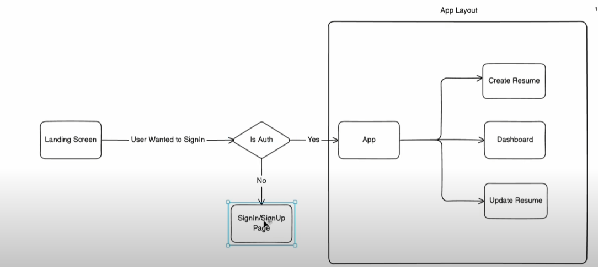
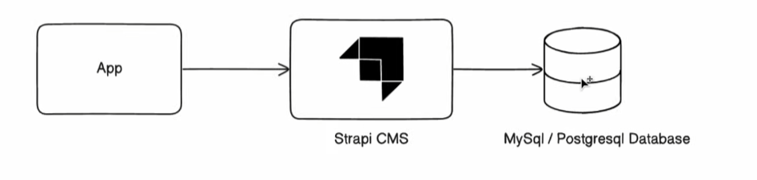

# React js Ai powered resume builder project

## folder structure:

- #### public folder :
- this is use store all your images
- SRC folder contain all our pages & components
- app.css is applied for app.jsx file
- index.css stylesheet for the complete application
- main.jsx file it's a starting point of our application .
- index.html this file is the main html file of the app .

## technology used in this project :

- **shandcn**, react,

## chapter: 2 React Routing :

- install react router dom : npm install react-router-dom
- got to [react-router](https://reactrouter.com/7.6.1/start) site for more info

## router v7 nested routing:

- create router
- ```Javascript
            const router = createBrowserRouter([
        {

            element: <App />,
            children: [
            {
                path: '/',
                element: <Home/>
            }
            ]
        },
        {
        path: '/auth/sign-in',

        element: <SignInPage/>
        },
        ])
        createRoot(document.getElementById('root')).render(
        <StrictMode>
            <RouterProvider router = {router}/>
        </StrictMode>,
        )

        // use the home page in app.jsx using outlet component of react-router


  ```

## user authentication diagram:



## setup starpi backend for the application :

- starpi backend & frontend diagram :
- 
- npx create-strapi-app@latest
- enter host name as localhost 

## clerk authentication user management.

- setup & follow the instruction from clerk authentication website
- paste clerk secret key in .env.local
  
## Dynamic Routing 
- inside the dashboard , create a new route

## tips , resources & advices:

- for team you can use github pull request extension
- use es7+ react extension
- for logo use logoipsum
- add custom colors in tailwind v4 link(https://www.youtube.com/watch?v=K6XO8FTiGIs)
- for free remote database use freesqldatabse or neon.tech free postgresql database or use link(https://dash.infinityfree.com/) or local db ;
